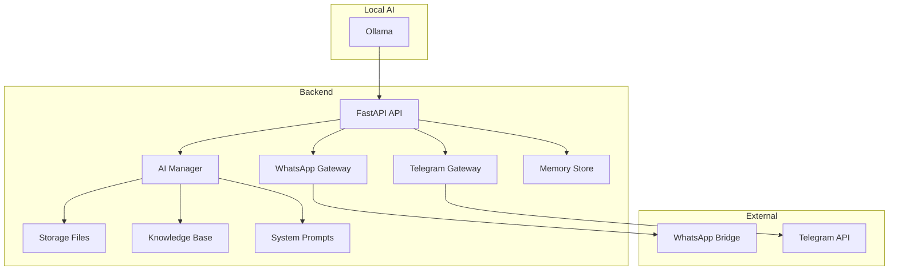

# Self-Hosted AI Assistant


[](https://github.com/naborajs/Self-Hosted-AI-Assistant)
[](./WHATSAPP_SETUP.md)
[](./TELEGRAM_SETUP.md)
[](./OLLAMA_SETUP.md)
[](./LICENSE)

## Project Banner

A privacy-first, local AI assistant platform for WhatsApp, Telegram, and Ollama. Configure behavior, train the model with knowledge, manage personalities, and control memory — all without touching code.

---

## Features

- Local Ollama-powered AI inference
- WhatsApp companion device bridge integration
- Telegram chat gateway support
- AI identity and personality management
- Global and platform-specific system prompts
- Preset reply engine with exact, keyword, and regex match
- Knowledge base and training import system
- Memory management for short-term and long-term context
- Admin API for runtime configuration
- Backup and restore for AI state
- Secure admin access and health monitoring

## Screenshots

> Replace these placeholders with real screenshots after setup.


## Architecture Overview



## Installation

See [INSTALLATION.md](./INSTALLATION.md) and [SETUP.md](./SETUP.md).

## Quick Start

1. Clone the repository:

```bash
git clone https://github.com/naborajs/Self-Hosted-AI-Assistant.git
cd Self-Hosted-AI-Assistant
```

2. Install Python dependencies:

```bash
python -m pip install -r requirements.txt
```

3. Configure your environment in `.env`.
4. Start the WhatsApp bridge:

```bash
cd whatsapp_bridge
npm install
npm start
```

5. Start the backend:

```bash
python main.py
```

6. Open `http://127.0.0.1:8000/docs` for API access.

## WhatsApp Setup

Follow the detailed guide in [WHATSAPP_SETUP.md](./WHATSAPP_SETUP.md).

## Telegram Setup

Follow the detailed guide in [TELEGRAM_SETUP.md](./TELEGRAM_SETUP.md).

## Ollama Setup

Follow the detailed guide in [OLLAMA_SETUP.md](./OLLAMA_SETUP.md).

## AI Customization

See [CUSTOMIZATION_GUIDE.md](./CUSTOMIZATION_GUIDE.md) and [PERSONALITIES.md](./PERSONALITIES.md).

## Knowledge Base

See [KNOWLEDGE_BASE.md](./KNOWLEDGE_BASE.md).

## Admin API

See [ADMIN_API.md](./ADMIN_API.md).

## Docker

See [DOCKER_GUIDE.md](./DOCKER_GUIDE.md).

## Troubleshooting

See [TROUBLESHOOTING.md](./TROUBLESHOOTING.md).

## License

This project is open source under the MIT License.
